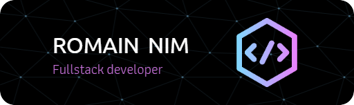

# Hi there! Thank you for stopping by 👋

Welcome to my GitHub profile! I'm a passionate web developer with a strong foundation in front-end technologies and experience in back-end development.

## 🛠️ Technologies & Tools

## 🌱 What I'm Currently Learning

- Enhancing my Node.js/Express skills by integrating TypeScript and experimenting with Jest for testing.
- Exploring the latest versions of Angular.

## 📫 How to Reach Me
[Email](mailto:contact@romain-nim.com)

## ⚡ Fun Facts

- I have a Bachelor of Arts in Web Design and an Associates in Information and Technology with a focus on Multimedia.
- I enjoy exploring new web technologies and staying updated with industry trends.
- When I'm not coding, I enjoy solving problems through bouldering and release my energy with a good run!

---

Feel free to connect with me. Let's build something amazing together! 🚀
